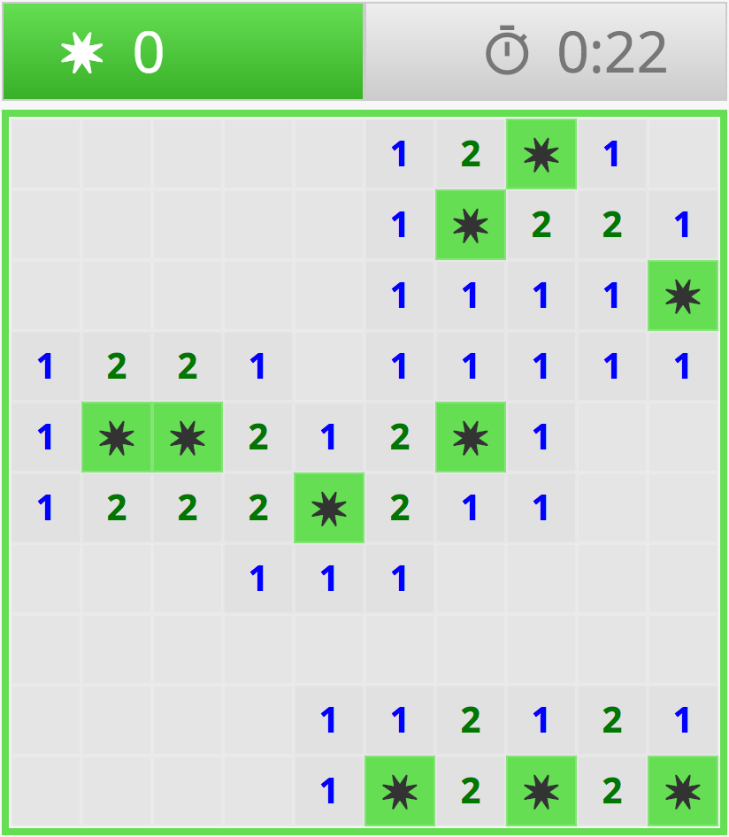
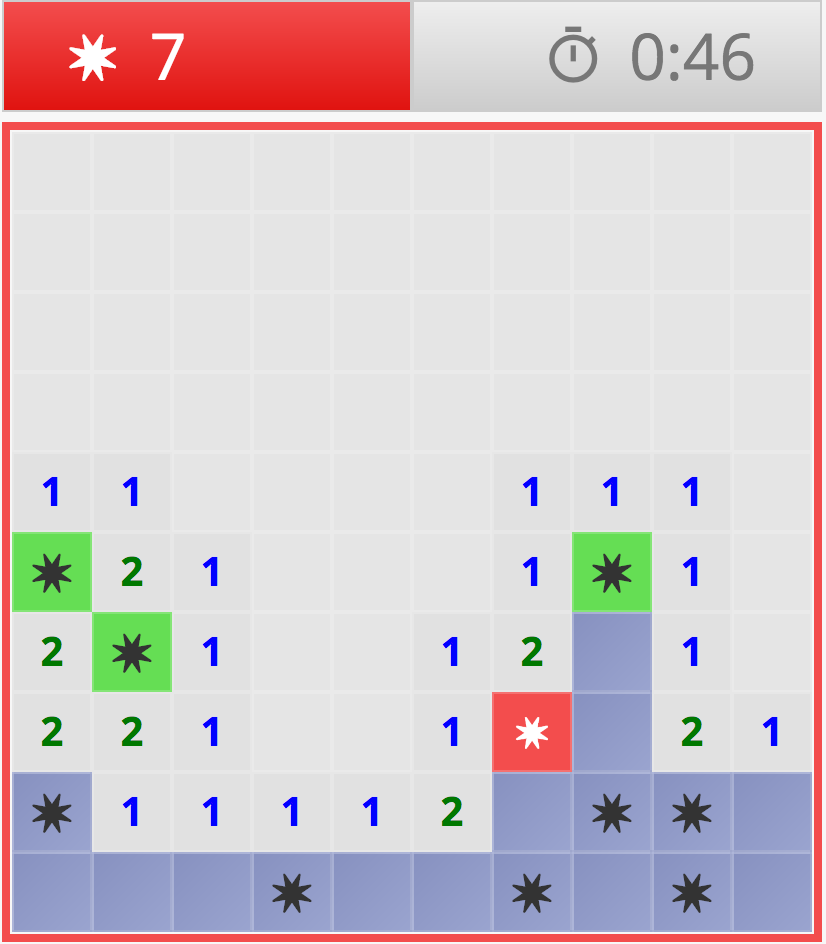

# Minesweeper with React + Redux

This is a minesweeper game built for fun. Uses React.js and redux.

* First run `npm install`.
* To run in dev mode, run `npm run start`.
* CSS is compiled from SCSS. To compile manually run `npm run build-css`, or run `npm run watch-css` to automatically compile CSS when the SCSS changes.

### DEMO

 
